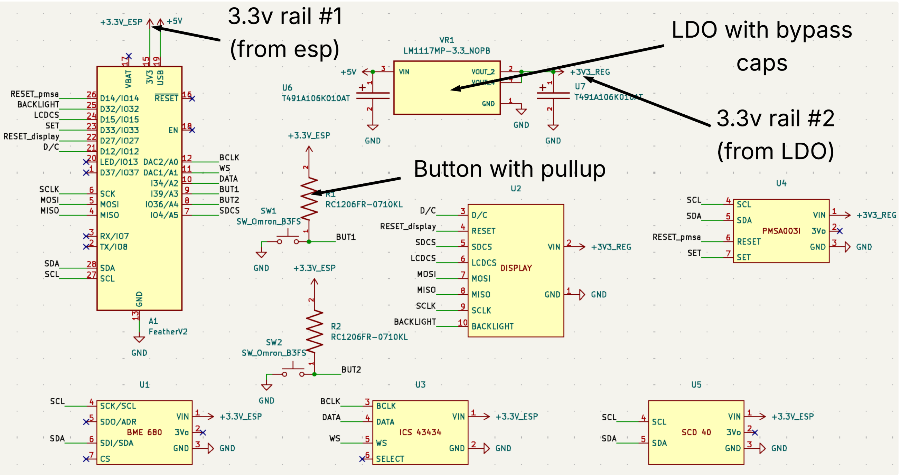
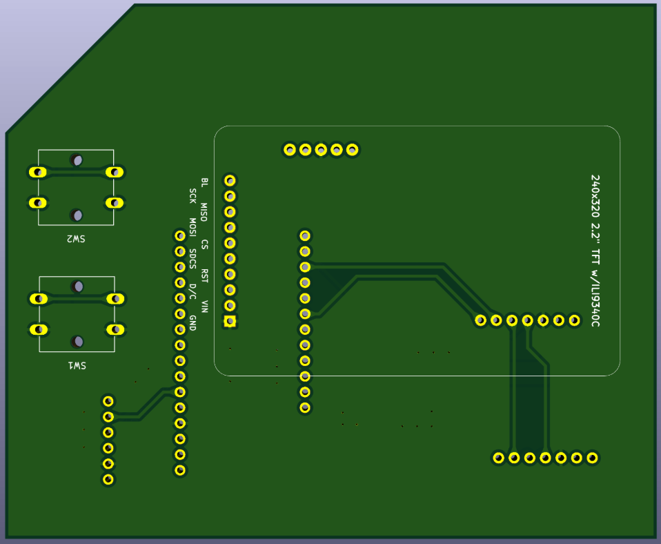
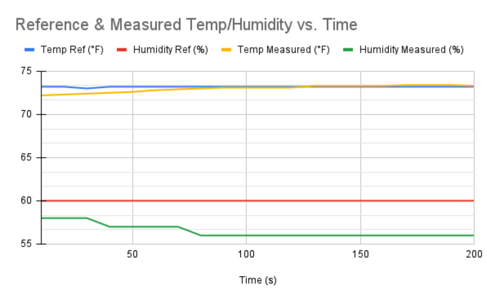
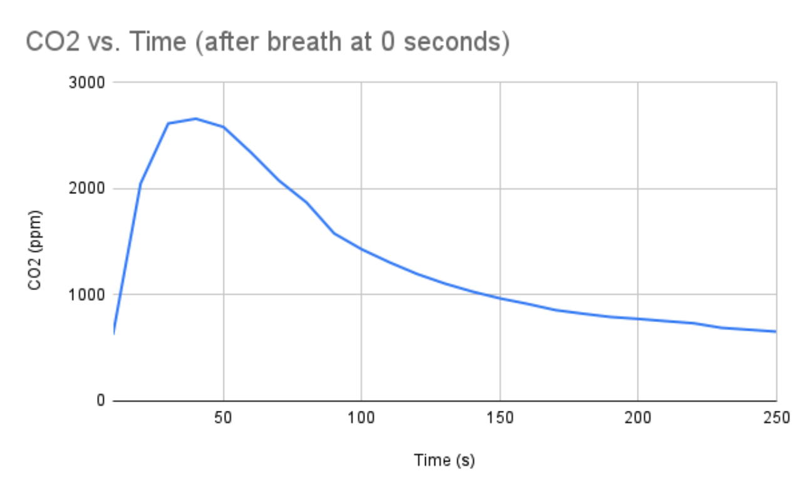
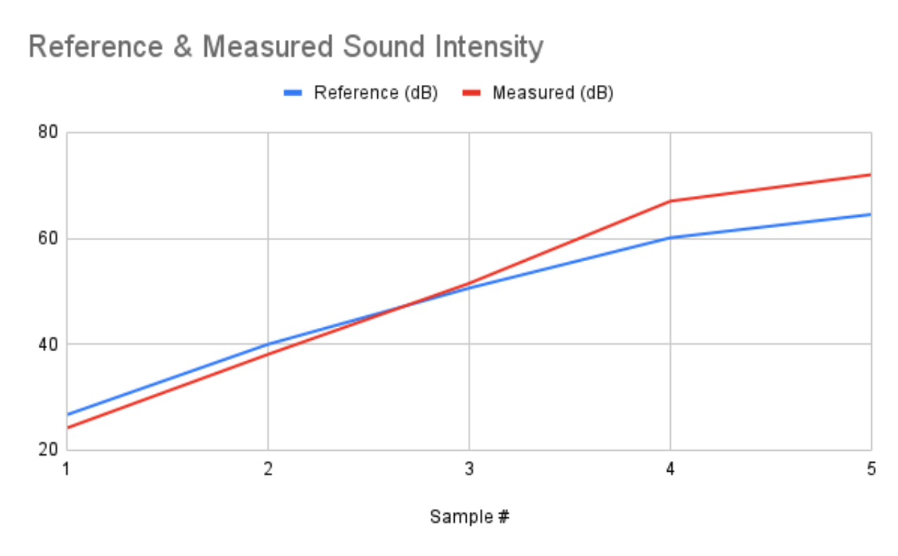

# Indoor Environmental Monitoring System

## Overview
This project is a custom indoor environmental monitoring system designed to measure and display air quality and comfort-related metrics in real time. It is built around an ESP32 (Adafruit Feather V2) and integrates multiple environmental sensors on a custom-designed PCB.

The system provides a clear and accessible way to understand indoor conditions, particularly in environments such as classrooms where air quality can impact focus and performance.

---

## What It Does

The system measures and displays:

- Temperature  
- Humidity  
- Gas / VOC levels  
- Carbon dioxide (CO₂)  
- Particulate matter (PM1.0, PM2.5, PM10)  
- Sound level (dB)  

Users can switch between multiple display views using onboard buttons.

---

## Hardware

### Microcontroller
- ESP32 (Adafruit Feather V2)

### Sensors
- BME680 — temperature, humidity, VOCs  
- SCD-40 — CO₂  
- PMSA003I — particulate matter  
- ICS-43434 — digital microphone (I2S)

### Display
- SPI-based LCD display

---

## System Architecture

- I2C: BME680, SCD-40  
- SPI: LCD display  
- I2S: ICS-43434 microphone  
- GPIO: user buttons (with external pull-up resistors)

---

## Power Design

The system uses two separate 3.3V rails:

- 3.3V rail from the ESP32 (low-power components)
- 3.3V rail from an external LDO regulator (higher load components)

This was necessary because the onboard regulator cannot supply sufficient current for all sensors simultaneously.

---

## PCB Design

### Annotated Schematic

### PCB Layout

### 3D View (Top)

### 3D View (Bottom)
bottom.png)

### Final Assembled Board

---

## Design Considerations

- ESP32 input-only pins do not include internal pull-up resistors, so external pull-ups were added
- An external LDO regulator was required to support total system current
- Bypass capacitors were included for stable power delivery
- The layout was designed to minimize noise for analog and sensor signals

---

## Testing and Results

### Temperature and Humidity

Measured values closely matched reference readings after initial stabilization. Temperature readings were slightly offset at startup but converged quickly.

---

### CO₂ Testing

Baseline CO₂ levels were around 650 ppm. During testing, levels were increased to approximately 2500 ppm and then observed to return to baseline over time, demonstrating proper sensor response.

---

### Sound Measurement

The system tracked sound levels accurately at lower decibel ranges. At higher levels (>60 dB), measurements showed slight overestimation, likely due to sensor placement and environmental factors.

---

## Environmental Scoring Algorithm

The system computes a score from 0 to 100 based on environmental conditions.

The score begins at 100 and deductions are applied based on:

- PM2.5 concentration
- CO₂ levels
- Noise level
- Temperature
- Humidity

If the score falls below 80, it is scaled slightly upward to maintain usability. The final score is clamped between 0 and 100.

This score provides a simple indicator of overall environmental quality.

---

## Key Outcome

The system successfully detects when CO₂ levels exceed 1000 ppm, a threshold associated with reduced cognitive performance in indoor environments.

---

## Build Process

1. Designed schematic using KiCad  
2. Created PCB layout  
3. Ordered and assembled board  
4. Integrated sensors and display  
5. Developed firmware on ESP32  
6. Tested and validated system performance  

---

## Future Improvements

- Data logging and long-term analysis  
- Mobile or web dashboard  
- Improved calibration for sound measurements  
- Battery-powered version  
- Alert system for poor environmental conditions  